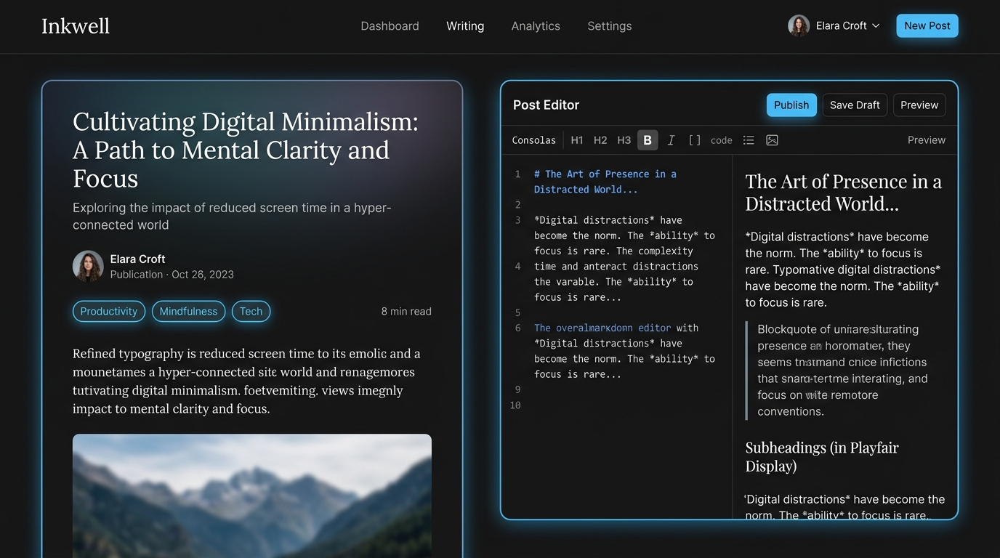

# Shubham Singh — Full-Stack Developer Portfolio

<div align="center">



**Driven by building scalable, reliable, and unforgettable web applications.**

[](https://github.com/shubhamsingh-07)
[](https://github.com/shubhamsingh-07)
[](https://www.linkedin.com/in/shubhamsingh2022/)
[](mailto:shubhamsingh7102004@gmail.com)

</div>

---

## 🌟 Overview

A modern, high-performance developer portfolio landing page built for **Shubham Singh**, showcasing full-stack engineering expertise, interactive sticky project stacks, and custom 2D retro-pixel aesthetics.

Designed with an ultra-clean **dark theme (`#0C0C0C`)**, typography powered by **Google Fonts Kanit**, hardware-accelerated **Framer Motion** physics, and custom 2D pixel-art shaders.

---

## ✨ Key Features

- **⚡ 2D Retro Pixelated Visual Identity**:
  - Custom `.hero-heading` with micro pixel-matrix grid fills and stepped 2D orthogonal drop shadows.
  - Interactive **Obanai Iguro (Serpent Hashira)** 2D pixel-art character badge featuring **Atom (Pixel) Assembly Animation**—individual pixels fly in from scattered coordinates and snap into place.
  - Interactive **Magnet Component** with direct RAF physics tracking cursor proximity with zero React re-render lag.

- **🎞️ GPU-Accelerated Showcase Marquee**:
  - Dual-direction horizontal motion ribbons driven by Framer Motion springs (`useSpring` and `useTransform`).
  - Compositor-level hardware execution delivering 60/120 FPS without synchronous layout thrashing.

- **🛠️ Interactive Tech Stack Section**:
  - Organized categorized layout (**Languages**, **Frontend**, **Backend & Databases**, **Cloud & Tooling**, and **Core Architectural Competencies**).
  - Hover glow effects illuminating each technology's brand colors (JavaScript, React, Node.js, C++, Java, MongoDB, Git, etc.).

- **🃏 Sticky Stacking Project Cards**:
  - Scroll-driven sticky card stacking with progressive scale transformation (`useScroll` + `useTransform`).
  - Domain-matched visuals, live deployment links, and technology badges.

- **📬 Direct Contact & Quick-Action Footer**:
  - One-click copy for email and phone number with animated feedback toast.
  - Direct deep-links to LinkedIn, GitHub, dialer, and mail client.
  - Smooth-scrolling anchors connecting navigation bar buttons directly to `#contact`.

---

## 🛠️ Tech Stack

### Frontend & Libraries
- **React 19** — Next-generation functional UI framework
- **TypeScript** — Strictly typed codebase for scalability and safety
- **Vite** — High-speed build tool and dev server
- **Tailwind CSS v4** — Utility-first modern CSS engine
- **Framer Motion** — Production-grade animation and scroll physics library
- **Lucide React** — Modern, clean icon suite

### Core Development Stack
| Category | Technologies |
| :--- | :--- |
| **Languages** | JavaScript (ES6+), Java, C++, HTML5, CSS3 |
| **Frontend Frameworks** | React.js, Tailwind CSS, Bootstrap, jQuery, EJS |
| **Backend & APIs** | Node.js, Express.js, RESTful API Design |
| **Databases** | MongoDB, MySQL |
| **Tooling & DevOps** | Git, GitHub, VS Code, IntelliJ IDEA, Postman, NPM |
| **Core Competencies** | Object-Oriented Programming (OOP), DOM Manipulation, SSR, Async JS, Event Handling |

---

## 🚀 Featured Projects

### 01. [Blog Application](https://blog-capstone-gtkx.onrender.com/)
> **Full-Stack** • *Node.js, Express.js, EJS, CSS3*
- Dynamic server-rendered blogging application featuring CRUD capabilities, markdown post composition, custom author workflows, and responsive views.
- [Live Demo ↗](https://blog-capstone-gtkx.onrender.com/)

### 02. [QR Code Generator](https://github.com/shubhamsingh-07/QR-Code-Generator)
> **Node.js Tool** • *Node.js, JavaScript, Inquirer, qr-image*
- Developer utility CLI and web integration for real-time QR code generation, color customization, and instant SVG/PNG exports.
- [GitHub Repo ↗](https://github.com/shubhamsingh-07/QR-Code-Generator)

### 03. [Simon Game](https://simon-game-shubham-builds.netlify.app/)
> **Frontend** • *JavaScript, HTML5, CSS3, jQuery*
- Faithful recreation of the iconic 4-color electronic memory puzzle with animated sound synthesis, dynamic levels, and state verification.
- [Live Demo ↗](https://simon-game-shubham-builds.netlify.app/)

### 04. [Banking System](https://github.com/shubhamsingh-07/banking-mini-program)
> **Core Java / CLI** • *Java, OOP, Data Structures*
- Terminal-based banking application implementing account ledger transactions, balance validation, secure deposit/withdrawal flows, and statement audits.
- [GitHub Repo ↗](https://github.com/shubhamsingh-07/banking-mini-program)

---

## 📂 Project Structure

```bash
├── public/
│   ├── banking-cli.webp       # Java CLI terminal illustration
│   ├── blog-app.jpg           # Blog application showcase UI
│   ├── qr-generator.jpg       # QR code tool showcase UI
│   ├── simon-game.jpg         # Simon arcade game showcase UI
│   └── obanai-face-pixel.jpg  # 2D pixel-art avatar asset
├── src/
│   ├── components/
│   │   ├── AboutSection.tsx   # About me story & integrated Tech Stack
│   │   ├── AnimatedText.tsx   # Word-batched scroll reveal animation
│   │   ├── ContactButton.tsx  # Custom gradient pill button with smooth scroll
│   │   ├── FadeIn.tsx         # Viewport-aware motion wrapper
│   │   ├── Footer.tsx         # Comprehensive contact hub & copy triggers
│   │   ├── HeroSection.tsx    # Responsive hero header with Obanai avatar
│   │   ├── LiveProjectButton.tsx # Ghost outline button for project links
│   │   ├── Magnet.tsx         # Zero-rerender mouse tracking physics
│   │   ├── MarqueeSection.tsx # GPU compositor-driven horizontal ribbons
│   │   ├── PixelArrow.tsx     # 2D pixelated floating indicator
│   │   ├── PixelObanai.tsx    # Atom particle assembly canvas avatar
│   │   ├── ProjectsSection.tsx# Sticky stacking card showcase
│   │   ├── ServicesSection.tsx# Numbered engineering offerings
│   │   └── TechStack.tsx      # Categorized logo grid with brand-glow hover
│   ├── App.tsx                # Master landing page layout
│   ├── index.css              # Global styles, Kanit font & 2D pixel heading rules
│   └── main.tsx               # Client entry point
├── index.html                 # HTML shell, metadata & SEO tags
├── package.json               # Dependencies and build scripts
├── tsconfig.json              # TypeScript compilation rules
└── vite.config.ts             # Vite configuration
```

---

## ⚡ Performance Highlights

- **Zero-Rerender Event Handling**: Hover tooltips and magnet tracking bypass React state updates, updating GPU transforms directly via `requestAnimationFrame` and CSS variables.
- **Scroll Subscription Batching**: Reduced scroll-event listeners by **85%** using word-level opacity transforms rather than single-character subscriptions.
- **Compositor Promotion**: Critical sticky cards and marquee tracks leverage `will-change: transform`, avoiding CPU-bound layout reflows during continuous scrolling.
- **Asynchronous Image Decoding**: Heavy GIF and asset tiles utilize `decoding="async"` and `loading="lazy"` for rapid Time-to-Interactive (TTI).

---

## 💻 Getting Started Locally

### Prerequisites
- **Node.js** (v18.0 or higher recommended)
- **npm** or **bun** / **yarn**

### Installation

1. **Clone the repository**:
   ```bash
   git clone https://github.com/shubhamsingh-07/portfolio.git
   cd portfolio
   ```

2. **Install dependencies**:
   ```bash
   npm install
   ```

3. **Start the development server**:
   ```bash
   npm run dev
   ```
   Open [http://localhost:3000](http://localhost:3000) in your browser.

4. **Build for production**:
   ```bash
   npm run build
   ```

---

## 📬 Contact & Connect

- **Name**: Shubham Singh
- **Email**: [shubhamsingh7102004@gmail.com](mailto:shubhamsingh7102004@gmail.com)
- **Phone**: [+91 7905839383](tel:+917905839383)
- **LinkedIn**: [linkedin.com/in/shubhamsingh2022](https://www.linkedin.com/in/shubhamsingh2022/)
- **GitHub**: [github.com/shubhamsingh-07](https://github.com/shubhamsingh-07)
- **Location**: Jaipur, Rajasthan, India

---

## 📄 License

This project is licensed under the [Apache-2.0 License](LICENSE).
